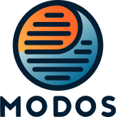

<p align="center">
  
</p>

<p align="center">
</p>
<p align="center">
  <a href="https://github.com/sdsc-ordes/modos-api/releases/latest">
    </a>
  <a href="https://github.com/sdsc-ordes/modos-api/actions/workflows/poetry-pytest.yml">
    </a>
  <a href="https://sdsc-ordes.github.io/modos-api">
    </a>
  <a href="http://www.apache.org/licenses/LICENSE-2.0.html">
    </a>
</p>

# modos-api

Access and manage Multi-Omics Digital Objects (MODOs).

## Context

### Goals

Provide a digital object and system to process, store and serve multi-omics data with their metadata such that:

- Traceability and reproducibility is ensured by rich metadata
- The different omics layers are processed and distributed together
- Common operations such as liftover can be automated easily and ensure that omics layers are kept in sync
- Data can be accessed, sliced and streamed over the network without downloading the dataset.

### Architecture

The client library by itself can be used to work with local MODOs, or connect to a server to access objects over s3.

The server configuration and setup insructions can be found in [deploy](deploy). It consists of a REST API, an s3 server and an htsget server to stream CRAM/BCF over the network. The aim is to provide transparent remote access to MODOs without storing the data locally.

### Format

The digital object is composed of a folder with:

- Genomic data files (CRAM, BCF, ...)
- A zarr archive for metadata and array-based data

The metadata links to the different files and provides context using the [modos-schema](https://sdsc-ordes.github.io/modos-schema).

## Installation

The library can be installed with pip:
```sh
pip install modos
```

The development version can be installed directly from github:

```sh
pip install git+https://github.com/sdsc-ordes/modos-api.git@main
```

## Usage

The CLI is convenient for quickly managing modos (creation, edition, deletion) and quick inspections:

```sh
$ modos show  -s3 https://s3.example.org --zarr ex-bucket/ex-modo
/
 ├── assay
 │   └── assay1
 ├── data
 │   ├── calls1
 │   └── demo1
 ├── reference
 │   └── reference1
 └── sample
     └── sample1

$ modos show --files data/ex
data/ex/reference1.fa.fai
data/ex/demo1.cram
data/ex/reference1.fa
data/ex/calls1.bcf
data/ex/demo1.cram.crai
data/ex/calls1.bcf.csi
```

The user facing API is in `modos.api`. It provides full programmatic access to the object's [meta]data:

```python
>>> from modos.api import MODO

>>> ex = MODO('./example-digital-object')
>>> ex.list_samples()
['sample/sample1']
>>> ex.metadata["data/calls1"]
{'@type': 'DataEntity',
 'data_format': 'BCF',
 'data_path': 'calls1.bcf',
 'description': 'variant calls for tests',
 'has_reference': ['reference/reference1'],
 'has_sample': ['sample/sample1'],
 'name': 'Calls 1'}
>>> rec = next(ex.stream_genomics("calls1.bcf", "chr1:103-1321"))
>>> rec.alleles
('A', 'C')
```

For advanced use cases, the object's metadata can be queried with SPARQL!
```python
>>> # Build a table with all files from male samples
>>> ex.query("""
...   SELECT ?assay ?sample ?file
...   WHERE {
...     [] schema1:name ?assay ;
...       modos:has_data [
...         modos:data_path ?file ;
...         modos:has_sample [
...           schema1:name ?sample ;
...           modos:sex ?sex .
...         ]
...       ] .
...     FILTER(?sex = "Male")
...   }
... """).serialize(format="csv").decode())
assay,sample,file
Assay 1,Sample 1,file://ex/calls1.bcf
Assay 1,Sample 1,file://ex/demo1.cram
```

## Contributing

First, read the [Contribution Guidelines](./CONTRIBUTING.md).

For technical documentation on setup and development, see the [Development Guide](docs/development_guide.md)


## Acknowledgements and Funding

The development of the Multi-Omics Digital Object System (MODOS) is being funded by the Personalized Health Data Analysis Hub, a joint initiative of the Personalized Health and Related Technologies ([PHRT](https://www.sfa-phrt.ch)) and the Swiss Data Science Center ([SDSC](https://datascience.ch)), for a period of three years from 2023 to 2025. The SDSC leads the development of MODOS, bringing expertise in complex data structures associated with multi-omics and imaging data to advance privacy-centric clinical-grade integration. The PHRT contributes its domain expertise of the Swiss Multi-Omics Center ([SMOC](http://smoc.ethz.ch)) in the generation, analysis, and interpretation of multi-omics data for personalized health and precision medicine applications.
We gratefully acknowledge the [Health 2030 Genome Center](https://www.health2030genome.ch/) for their substantial contributions to the development of MODOS by providing test data sets, deployment infrastructure, and expertise.

## Copyright

Copyright © 2023-2024 Swiss Data Science Center (SDSC), [www.datascience.ch](http://www.datascience.ch/). All rights reserved. The SDSC is jointly established and legally represented by the École Polytechnique Fédérale de Lausanne (EPFL) and the Eidgenössische Technische Hochschule Zürich (ETH Zürich). This copyright encompasses all materials, software, documentation, and other content created and developed by the SDSC in the context of the Personalized Health Data Analysis Hub.
