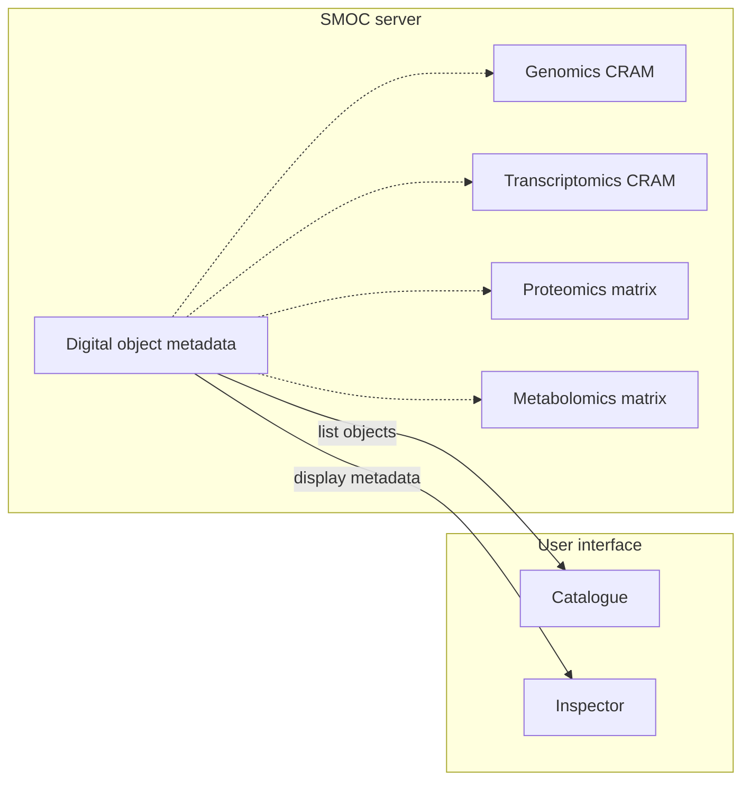

# SMOC-PoC

Initial system for creating and serving multi-omics digital objects.

## Motivation

Provide a digital object and system to process, store and serve multi-omics data with their metadata such that:
* Traceability and reproducibility is ensured by rich metadata
* The different omics layers are processed and distributed together
* Common operations such as liftover can be automated easily and ensure that omics layers are kept in sync

## Architecture

The digital object is composed of multiple files:
* CRAM files for alignment data, Zarr
* HDF5 files for array data
* RDF for metadata (either separate, or embedded in the array file).

A webserver is required to list available objects and serve them over the network.

The basic structure is as follows:

## Implementation details

* To allow horizontal traversal of digital objects in the database (e.g. for listing), the metadata would need to be exported in a central database/knowledge-graph on the server side.
* Metadata can be either embedded in the array file, or stored in a separate file
* Each digital object needs a unique identifier
* The paths of individual files in the digital object must be referenced in a consistent way.
  + Absolute paths are a no-go (machine/system dependent)
  + Relative paths in the digital object could work, but need to be OS-independent
 

# Status and limitations

* Focusing on data retrieval, object creation not yet implemented
* The htsget protocol supports streaming CRAM files, but it is currently only implemented for BAM in major genome browsers (igv.js, jbrowse)
