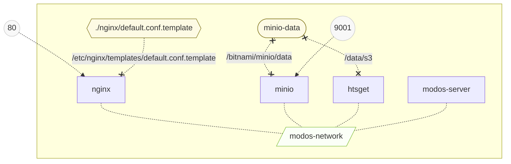

# Server deployment

> [!WARNING]
> This is a work in progress and not production-ready yet.

## Context

This directory contains the necessary files to deploy a multi-omics digital objects (MODOs) server.

The modos-server is meant to provide remote access to the MODOs. Currently, it can:

- [x] list available MODO
- [x] return their metadata
- [x] expose a MODO directly as a client-accessible S3 bucket / folder
- [x] stream CRAM slices using htsget
- [ ] manage authentication and access control

The MODOs are stored in an s3 (minio) bucket, and an htsget server is deployed alongside the modos-server to handle slicing and streaming of CRAM files. A REST API is exposed to the client to interact with the remote MODOs.

All services are accessible at a single access point through an nginx reverse proxy on port 80.



## Setup

> [!IMPORTANT]
> The instructions below are meant for development.
> Production use would require changing the default
> credentials and use authentication.

1. Start the server

```sh
make deploy
```

2. Upload MODO(s) to the default bucket from the minio console (default is http://localhost:9001)
3. Login to the minio console (default credentials are minio/miniosecret)

## Usage

Once the server is started, a client can connect to the following endpoints:

- `http://localhost:80/htsget`: directly access the htsget server
- `http://localhost:80/s3`: directly access the s3 server
- `http://localhost:80/list`: list modos on the server
- `http://localhost:80/meta`: return all metadata on the server

## Configuration

Most parameters can be configured using environment variables.
The easiest way to change environment variables is to use a `.env`. An example is provided and can be used as follows:

```sh
mv .example.env .env
# edit .env as required
docker compose up --build
# docker compose automatically reads the .env file
```

In the `.env` file, each service has a `<service>_PUBLIC_URL` and a `<service>_LOCAL_URL` variable. The public URL is the address used by external clients, whereas LOCAL_URL is the address used by other services. For services deployed as part of the compose setup, the local address is `http://<service-name>:<service-port>` and the public address is the endpoint exposed by the nginx reverse proxy, typically `http://<server-host>/<service-name>`. If a service is deployed outside the compose, e.g. an external s3 bucket, the public and local address will both be pointing to the external address.

### Streaming with minio

There are two options to use htsget streaming with the minio embedded in the compose setup:

1. Set `S3_PUBLIC_URL=http://<LOCAL-IP>:9000` where `<LOCAL-IP>` is your local IP address (find it using hostname -I). **This is done automatically when starting the server with `make deploy`**.

2. Manually create a host mapping from the minio service to localhost on the machine:
> `echo "127.0.0.1 minio" >> /etc/hosts`


These steps are not needed when using an external S3 server, in which case `S3_PUBLIC_URL` can just be set to the external S3 endpoint.

> [!NOTE]
> These steps are needed because the S3 host must be available under the same name to both the client and htsget. This is because the canonical URI (incl. hostname) is used to [derive s3 signature keys](https://docs.aws.amazon.com/IAM/latest/UserGuide/create-signed-request.html).
