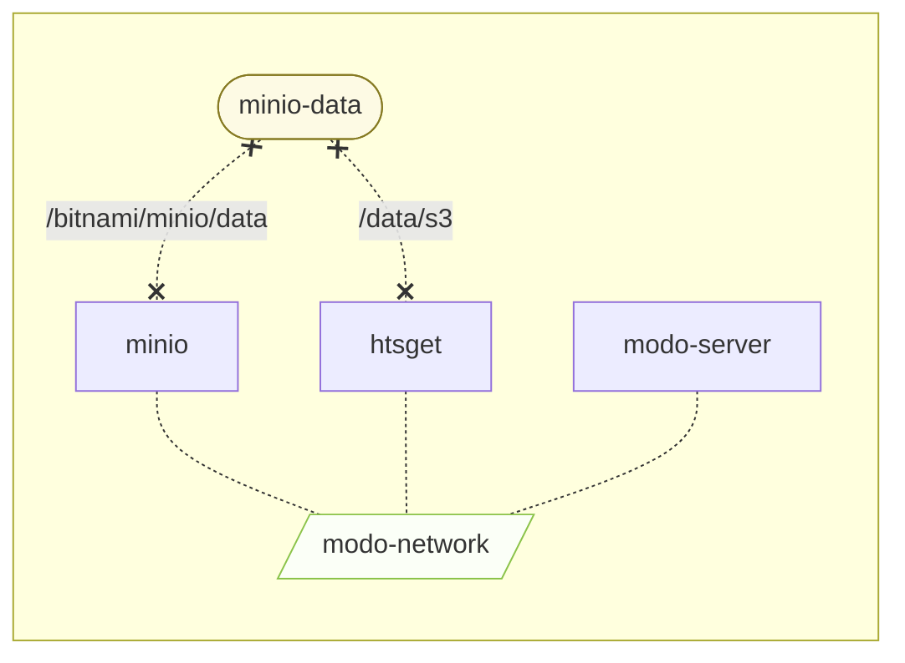

# Server deployment

> [!WARNING]
> This is a work in progress and not production-ready yet.

## Context

This directory contains the necessary files to deploy a multi-omics digital objects (MODO) server.

The modo-server is meant to provide remote access to the MODOs. Currently, it can:

* [x] list available MODO
* [x] return their metadata
* [ ] stream CRAM slices CRAM using htsget
* [ ] expose a MODO directly as a client-accessible S3 bucket / folder
* [ ] manage authentication and access control

The MODOs are stored in an s3 (minio) bucket, and an htsget server is deployed alongside the modo-server to handle slicing and streaming of CRAM files. A REST API is exposed to the client to interact with the remote MODOs.




## Setup

> [!IMPORTANT]
> The instructions below are meant for local testing.
> Production use would require changing the default
> credentials and use authentication.

1. Start the server
```sh
cd deploy
docker compose up --build
```
2. Upload MODO(s) to the default bucket from the minio console (default is http://localhost:9001)
3. Login to the minio console (default credentials are minio/miniosecret)


## Usage

Once the server is started, a client can connect to the following endpoints:
* `http://localhost:8000/list`: list modos on the server
* `http://localhost:8000/meta`: return all metadata on the server
